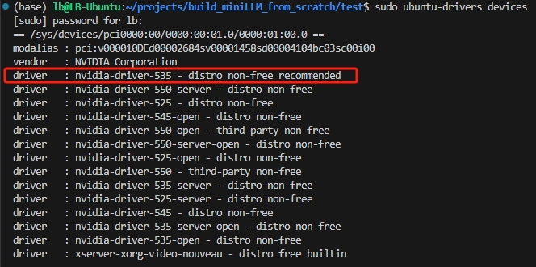
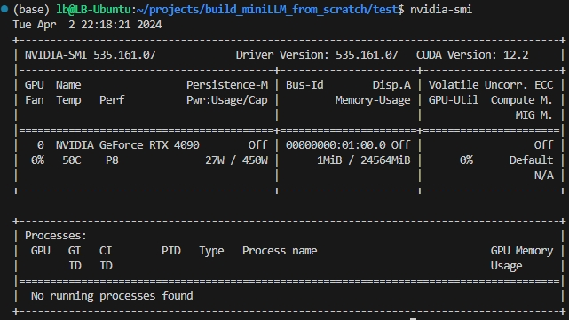
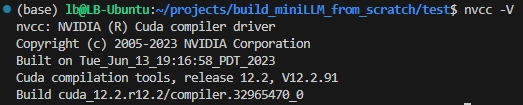

# deepspeee的安装（含cuda安装）
## 1. 总结
- **仅使用gpu版torch，无需手动安装cuda**：仅需要安装下cuda的驱动（对应能nvidia-smi）即可，因为安装gpu版本torch的时候是conda自动帮你安装conda版本的cuda组件（含cuda/cudnn等，cuda-nvcc需手动conda安装）；
- **deepspeed需要手动安装cuda**：如上使用deepspeed会提示CUDA_HOME找不到，即在`/usr/local/`目录下没有cuda文件夹，于是本人经验是如需使用deepspeed需手动安装cuda

## 2. cuda安装
### 2.1 几个cuda组件的说明
|组件名|作用|
|----|----|
|cuda driver|驱动，`nvidia-smi`是否可用，使用cuda必备项|
|cudatoolkit(nvidia)|CUDA完整的工具安装包，其中提供了 Nvidia 驱动程序、开发 CUDA 程序相关的开发工具包等可供安装的选项。包括 CUDA 程序的编译器、IDE、调试器等，CUDA 程序所对应的各式库文件以及它们的头文件|
|cudatoolkit(pytorch)|CUDA不完整的工具安装包，其主要包含在使用 CUDA 相关的功能时所依赖的动态链接库。不会安装驱动程序。|
|cudnn|为深度学习计算设计的软件库|

## 2.2 cudatoolkit安装

### 1） 驱动安装
- 安装cuda驱动 `sudo ubuntu-drivers devices`
  
- 查看哪个后面有recommand, 比如 `sudo apt install nvidia-driver-535`
- 安装后可使用`nvidia-smi`查看

  

### 2） cudatoolkit(nvidia)安装
- [cudatoolkit网址](https://developer.nvidia.com/cuda-toolkit-archive), 选择合适的版本，以[12.2为例](https://developer.nvidia.com/cuda-12-2-0-download-archive?target_os=Linux&target_arch=x86_64&Distribution=Ubuntu&
  ```shell
  wget https://developer.download.nvidia.com/compute/cuda/12.2.0/local_installers/cuda_12.2.0_535.54.03_linux.run
  sudo sh cuda_12.2.0_535.54.03_linux.run`
    ```
- 包含了`cuda driver`，但是我安装的时候一直报错，于是我只勾选了`cudatoolkit`（下图为网图示例）

  安装.png)
- 安装完成需要配置下环境变量
  ```shell
  # 编辑环境变量
  vim ~/.bashrc
  
  # 在末尾添加环境变量
  export PATH=/usr/local/cuda/bin:$PATH  
  export LD_LIBRARY_PATH=/usr/local/cuda/lib64:$LD_LIBRARY_PATH

  # 保存退出，输入
  source ~/.bashrc
  ```
- 可使用`nvcc -V`命令，也可以在`/usr/local/`下查询到cuda目录
  
  

## 2.3 cuda卸载
- 卸载cuda，注意会连同`cuda driver`一起卸载，卸载后torch不可用，需要重新安装`cuda driver`
    ```shell
    sudo apt-get --purge remove "*cuda*" "*cublas*" "*cufft*" "*cufile*" "*curand*" "*cusolver*" "*cusparse*" "*gds-tools*" "*npp*" "*nvjpeg*" "nsight*" "*nvvm*"
    sudo apt-get --purge remove "*nvidia*" "libxnvctrl*"
    sudo apt-get autoremove
    ```

## 3. deepspeed安装
- 之前遇到很多问题，一直以为是deepspeed安装的问题，安装好cudatoolkit后，仅需最简单的安装姿势`pip install deepspeed`

## 4. Reference
- [RuntimeError: Error building extension 'fused_adam'](https://github.com/microsoft/DeepSpeed/issues/4889)
- [linux环境安装cuda toolkit](https://blog.csdn.net/leo0308/article/details/136414444)
- [安装NVIDIA驱动出现: An NVIDIA kernel module ‘nvidia-drm‘](https://blog.csdn.net/w09103419/article/details/112303385)